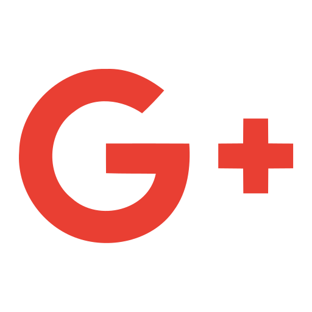

### Hello my name is Hannah Noelia, everybody tell me Hannah Chan  

<!--  -->

## Full Stack JavaScript Web Developer

- 🌱 I’m currently learning everything, specially Javascript and ReactJSs
- 🥅 2021 Goals: Portfolio / CMS
- ⚡ Fun fact: I love programming and I love play Halo 6

### Languages and Tools:

 
 

---

### YouTube Channel
<!-- YOUTUBE:START -->
- [Set up Neovim on a new M2 MacBook Air for coding React, TypeScript, Tailwind CSS, etc.](https://www.youtube.com/watch?v=ajmK0ZNcM4Q)
- [For beginners: How to create a &#39;link in bio&#39; page for Instagram &lpar;No frameworks&rpar;](https://www.youtube.com/watch?v=u71pHOyvBp0)
- [How to build Gmail-like UI with React Native [at a Zen temple Koshoji]](https://www.youtube.com/watch?v=w-M9UFHLAl0)
- [Behind the scenes: How I film and create typing chat bubble effect in videos](https://www.youtube.com/watch?v=zu_vqAWHy_E)
- [How I built a software agency website with Next.js + Tailwind CSS &lpar;in nature&rpar;](https://www.youtube.com/watch?v=GznmPACXBlY)
<!-- YOUTUBE:END -->

---

### Blog posts
<!-- BLOG-POST-LIST:START -->
- [How to prevent GitHub from suspending your cronjob based triggers](https://dev.to/gautamkrishnar/how-to-prevent-github-from-suspending-your-cronjob-based-triggers-knf)
- [Show your latest dev.to posts automatically on your GitHub profile readme](https://dev.to/gautamkrishnar/show-your-latest-dev-to-posts-automatically-in-your-github-profile-readme-3nk8)
- [God Mode in browsers: document.designMode = &quot;on&quot;](https://dev.to/gautamkrishnar/god-mode-in-browsers-document-designmode-on-2pmo)
- [Skipping the Chrome &quot;Your connection is not private&quot; warning](https://dev.to/gautamkrishnar/quickbits-1-skipping-the-chrome-your-connection-is-not-private-warning-4kp1)
- [Microsoft Student Partners – Geek is the new rockstar](https://dev.to/gautamkrishnar/microsoft-student-partners--geek-is-the-new-rockstar)
<!-- BLOG-POST-LIST:END -->

---

|  GitHub Stadistics     | Top Languages |
|:-:|:-:|
|       |        |

### My social networks:

