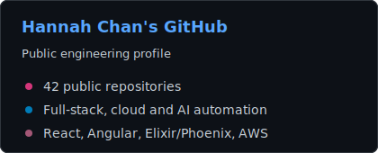
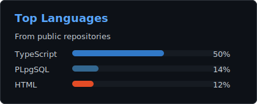

### Hello, my name is Hannah Noelia Narvaez Juarez

## I developed AgoraShell and NexusPlanner

| Project | Description | Links |
|:-|:-|:-:|
| AgoraShell | Developer community/forum project built as one of my main products. | [Website](https://agorashell.com/) |
| NexusPlanner | Planning/productivity project focused on organizing work and execution. | [Portfolio](https://hannah-narvaez-portfolio.netlify.app/#projects) |
| Personal Portfolio | My web portfolio with projects, experience, and contact links. | [Website](https://hannah-narvaez-portfolio.netlify.app/) |

## Full Stack Software Engineer | AI Automation & AWS

- I build full-stack web products with React, Angular, Node.js, Elixir/Phoenix, and modern UI systems.
- I automate workflows with AI connectors, AWS Lambda, CI/CD, and practical cloud services.
- I enjoy difficult engineering problems, clean architecture, UI/UX, accessibility, and learning deeply.
- Current focus: scalable products, integrations, CMS/platform tooling, mathematics, and AI-assisted automation.

### Languages

  
  
  
  
  
  
  
  

### Frameworks, Tools and Cloud

  
  
  
  
  
  
  
  
  
  
  
  
  
  

### Experience Highlights

- Software Engineer at Magistrans Mexico, building scalable web architecture with Phoenix LiveView, Tailwind, Flowbite, and full-stack product systems.
- Sr. Software Engineer Associate Manager at Accenture, working on React, Angular, Jenkins, SonarQube, AWS, unit testing, and WCAG-aligned enterprise portals.
- Sr. Web Developer experience across banking, financial services, media, CMS platforms, REST/GraphQL APIs, SSR, Redux sagas, and UI/UX implementation.

---

### GitHub Statistics

| GitHub Stats | Top Languages |
|:-:|:-:|
|  |  |

### Contribution Activity

### My Social Networks

 
